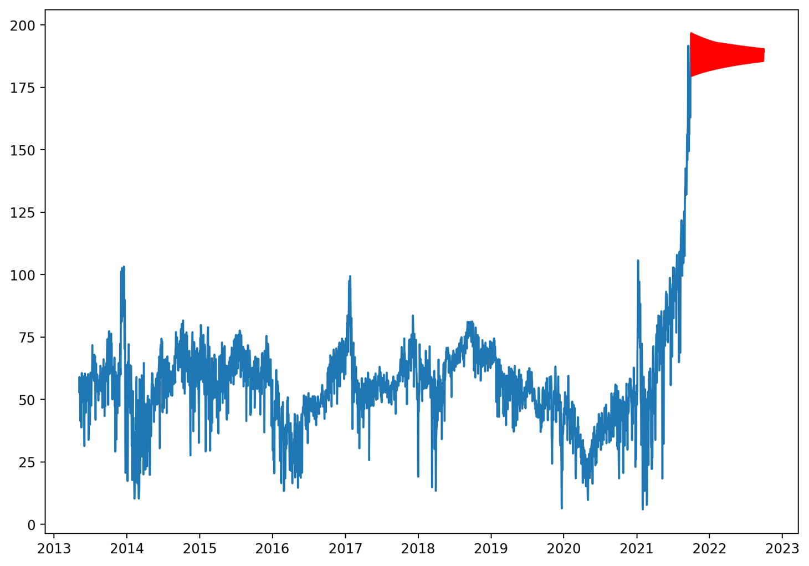

# Electricity Prices Predictions in Spain -- Data Science Master's Dissertation

## Introduction

The aim of this project was to predict the overall daily electricity price in Spain, after deeply studying and understanding all the relevant variables that make up the mentioned price.

Historical electricity prices datasets, as well as weather conditions and Brent crude oil futures prices were used along with forecasting/prediction models and various techniques of data mining, engineering and processing. 

This topic was chosen because it became an issue of real interest in 2021 in Spain, due to the enormous and non-expected price increases seen through the year.
As it can be seen from the code and analysis of the data, 2021 prices have reached maximum levels never seen before in the market and, therefore, very difficult to predict.

Anyone interested in time series forecasting might find this project interesting. 

## Methodology

Documentation and Notebooks in this repository cover steps from **Data Acquisition** to **Data Cleansing** and **Pre-Processing**, along with **Data Analysis** and **Modelling** and the design of an interactive **Front-End**. 

### Data

Data from different sources was used and could be categorised in four sections:

- **Electricity price** data
- **Brent Oil Crude futures** data
- **Weather** variables data
- **Population** data

### Conda Environment

Python 3.9 was the coding language used along this project. In order to maintain replicability, a [Conda environment](/tfm-environment7.yml) was created and saved in a .yml file.

### Modelling

Three scenarios can be identified in the Jupyter Notebooks for this project:

- Models and feature engineering using data from 2013 to 2020.
- Models and feature engineering using data from 2013 to 2021.
- Models and feature engineering using data from 2013 to 2021, identifying and handling outliers.

The predictions made using data up to September 2021 without handling outliers is the scenario that was used for the front end. This is because predictions were more in line with reality in the short-term than in the other two scenarios. 

When modelling, two types of common time series forecasting methods were used:

- **ARIMA**, univariate time series, using only the past Electricity prices to forecast themselves.

**ARIMA(10,1,0)**

**ARIMA(4,1,5)**

- **Vector Auto Regression (VAR)**, multivariate time series.

**VAR Forecast from October 2021**

In order to be able to use this models, autocorrelation in the data was tested, as well and normality and stationarity in the time series.

## Fron-End

You can see the results of this project in this [interactive web app](https://share.streamlit.io/paulacervilla/streamlit-app/Front-end-script.py), that was done using Streamlit.

## Summary and Conclusions

Overall, models performed quite well with short-term predictions. 
The issue with these kinds of models is that long-term forecasts tend to go to the mean of the data or will follow a straight line, depending on the parameters used to fit the models.

For more information about where to get the data from, instructions and further details on the project, please read [the documentation](/Masters%20dissertation%20-%20Electricity%20prices%20predictions%20in%20Spain%20--%20Paula%20Cervilla%20García.pdf).

